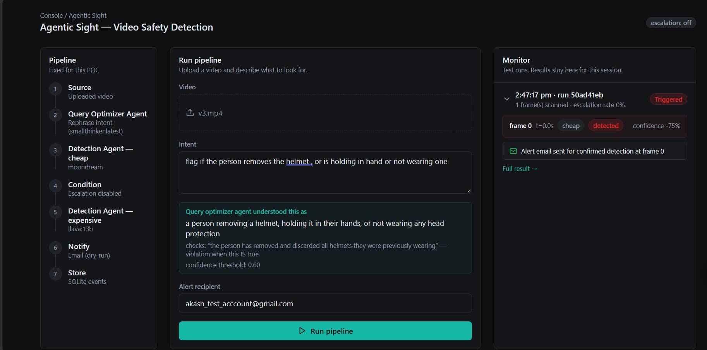
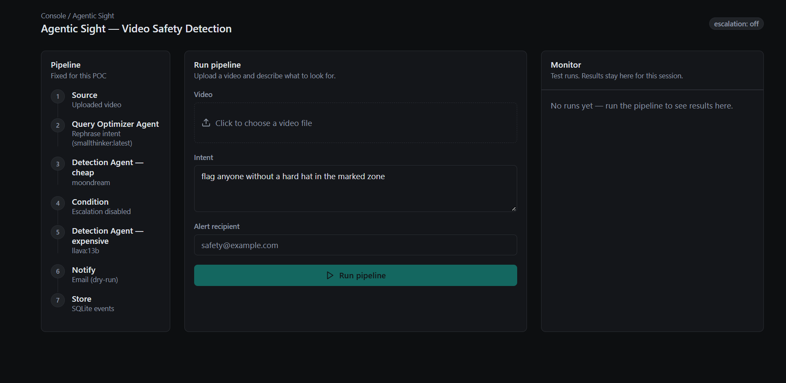

# Agentic Sight

**Natural-language video intelligence with agentic task planning, cost-gated vision models, temporal confirmation, and structured events.**

Agentic Sight is an end-to-end AI video intelligence POC that turns a natural-language detection request into a runnable video-analysis pipeline.

For example:

> "Flag anyone without a hard hat in the marked zone."

The system interprets the request, samples the video, uses vision models to analyze relevant frames, validates potential detections against neighboring frames, and produces a structured event that can trigger a notification.

The project is intentionally a **POC**, focused on exploring the backend orchestration and model-integration problems involved in turning natural-language intent into useful video intelligence — not on shipping a production-grade detector.

---

## Demo

[](https://youtu.be/TIo9dhJd90Q)

# Agentic-sight-images



The demo shows the complete flow:

```text
Natural-language intent
        ↓
Query Optimizer Agent (intent → task)
        ↓
Video sampling
        ↓
Detection Agent (vision model, cheap → expensive escalation)
        ↓
Neighbor-frame confirmation
        ↓
Structured event
        ↓
Notification
```

---

## Video Detection

The system processes a pre-recorded video based on a natural-language detection request.

Instead of sending the entire video to a model, the POC samples the video at a configurable interval (every 2 seconds by default) and processes the sampled frames sequentially.

```text
Video
  │
  ├── Frame 1 ──► Vision model
  ├── Frame 2 ──► Vision model
  ├── Frame 3 ──► Vision model
  │
  └── ...
```

The initial implementation uses a smaller local vision model (moondream) as the first layer. When a frame produces an ambiguous result — confidence too close to the threshold — the system escalates it to a stronger model (llava), a behavior that's fully configurable and can be switched off entirely via `ESCALATION_ENABLED`.

A candidate detection is also checked against the frames immediately before and after it before being treated as a confirmed event — this helps rule out one-off false positives from a single blurry or ambiguous frame, and the scan only stops once a detection is actually confirmed; a rejected candidate doesn't stop the scan.

The vision model is always asked an affirmative, literal question (e.g. "is the person wearing a hard hat?") rather than a negated one ("is the person *not* wearing a hard hat?") — small vision models are unreliable at judging negated conditions directly, even when they perceive the scene correctly. The Query Optimizer Agent derives the affirmative condition and which polarity counts as a violation; the actual violation boolean is then computed deterministically in code, not left to the model to reason about.

The overall approach evolved from the limitations and observations encountered while implementing the POC. The reasoning behind the design changes, model choices, sampling strategy, escalation approach, the negation fix, and the UI can be found in:

**[POC Requirements & Architecture Evolution](docs/plans/poc-requirements.md)**

---

## Architecture

> **Architecture diagram will be added here.**
>
> <!--  -->

The current system consists of a Next.js frontend and a FastAPI backend around the video-analysis pipeline, orchestrated by two LangGraph agents.

At a high level:

```text
User
 │
 │ natural-language query + video
 ▼
┌──────────────────┐
│    Next.js UI    │
└────────┬─────────┘
         │
         ▼
┌──────────────────┐
│    FastAPI       │
└────────┬─────────┘
         │
         ▼
┌────────────────────────┐
│        Pipeline        │
│                         │
│ Query Optimizer Agent   │  intent → task (positive_condition + violation_when)
│ Video Sampling          │
│ Detection Agent         │  cheap → expensive model routing
│ Neighbor Confirmation   │
└────────────┬────────────┘
             │
             ▼
┌──────────────────┐
│ Structured Event │
└────────┬─────────┘
         │
      ┌──┴───┐
      ▼      ▼
   Storage  Alert
```

### Flow

1. The user submits a video and describes what they want to detect.
2. The **Query Optimizer Agent** converts the intent into a structured detection task — an affirmative condition to check, and whether the violation is the condition's absence or its presence.
3. The video is sampled at the configured interval (default: every 2 seconds).
4. Sampled frames are passed through the **Detection Agent**, one at a time, sequentially.
5. An ambiguous result can be escalated from the cheap model to the stronger model.
6. A candidate detection is checked against the neighboring frames before being trusted.
7. A confirmed detection is converted into a structured event (Pydantic `Event`).
8. The event is stored in SQLite and an alert email is sent (or dry-run logged).
9. The result — including every processed frame, not just the confirmed one — is returned to the UI, which shows the full `RunSummary`, escalation banners, and the query optimizer's derived task.

For the detailed reasoning behind each architectural iteration, see **[POC Requirements & Architecture Evolution](docs/plans/poc-requirements.md)**.

---

## Tech Stack

### Backend

* Python
* FastAPI
* LangGraph
* Pydantic
* SQLite

### AI

* Ollama
* Local vision-language models (moondream, llava)
* Local text model for intent/task generation (llama3.1)
* Structured (JSON-mode) model outputs, with fallback parsing for small-model quirks
* Configurable cheap/expensive model escalation

### Frontend

* Next.js (App Router)
* React
* TypeScript
* Tailwind CSS

### Video

* Frame extraction (OpenCV)
* Configurable frame sampling interval
* Timestamp-based targeted frame extraction
* Neighbor-frame confirmation

### Observability

* Structured logging throughout every module
* Phoenix tracing (per-model-call spans)

---

## Current Scope

The current POC focuses on the core backend and orchestration problems relevant to an AI-powered video intelligence system.

It currently supports:

* Natural-language detection requests
* Intent-to-task generation via the Query Optimizer Agent, including affirmative/negation handling
* Video file processing
* Configurable frame sampling
* Local vision-model inference via the Detection Agent
* Cheap/strong model escalation, individually toggleable
* Neighbor-frame confirmation before an event fires
* Structured detection events
* Confidence and reasoning information per frame
* SQLite persistence
* Email notifications (dry-run or real SMTP)
* FastAPI backend with multipart video upload and CORS
* Next.js monitoring UI with per-frame detection results and escalation banners
* Basic model/inference observability (logging + Phoenix tracing)

The system is intentionally local-first and currently works with pre-recorded videos rather than live streams. These constraints were deliberate choices for the POC and are discussed in the architecture evolution document.

---

## Future Scope

The current POC demonstrates the core flow, but there are several areas that would be interesting to explore further.

* **Better models:** The current accuracy is limited by the small local models being used. Integrating a stronger vision model and comparing the results would be a natural next step.

* **Custom event logic:** If a person removes a helmet, puts it back on, and removes it again, should that generate one event or multiple events? More configurable event/state logic would be needed for these kinds of requirements.

* **Video-native models:** It would be useful to compare the current frame-based approach with a model that can directly understand video and temporal context.

* **Evaluation across models:** Build a proper evaluation dataset and metrics to compare multiple models and understand where each model performs well or poorly. The current small models work for only a limited set of scenarios.

* **More notification channels:** Email is currently the notification mechanism. The same event system could be extended to channels such as WhatsApp or phone calls.

* **Parallel frame processing:** The current POC processes frames sequentially because inference is running locally through Ollama. If inference were moved to a service where parallel requests were practical, frames could be processed concurrently to reduce overall processing time.

---

## Running the Project

The setup and execution instructions are intentionally kept separate from this README.

See **[`docs/RUNNING.md`](docs/RUNNING.md)** for:

* Environment setup
* Ollama models
* Backend setup
* Frontend setup
* Running the API
* Running the UI
* CLI usage
* Email configuration
* Optional tracing

---

## Why I Built This

I came across the problem Antrino Labs is working on and found the idea of turning the physical world into something that can be queried and acted on particularly interesting.

The idea behind Agentic Sight was to explore a small version of that problem myself:

> What happens when a user can describe something they care about in natural language, and the system turns that intent into an actual video-analysis workflow?

Rather than building only a vision-model demo, I wanted to explore the engineering layer around the models — intent handling, orchestration, model selection, uncertainty, evidence, and turning model output into something the rest of a system can actually use.

This POC is my attempt to build that flow end-to-end and understand the trade-offs involved.

---

## More About the POC

The detailed **Requirements & Architecture Evolution** document explains how the system was developed, what changed between iterations, what constraints were discovered during implementation, and the reasoning behind the current design.

**[Read the POC Requirements & Architecture Evolution →](docs/plans/poc-requirements.md)**
