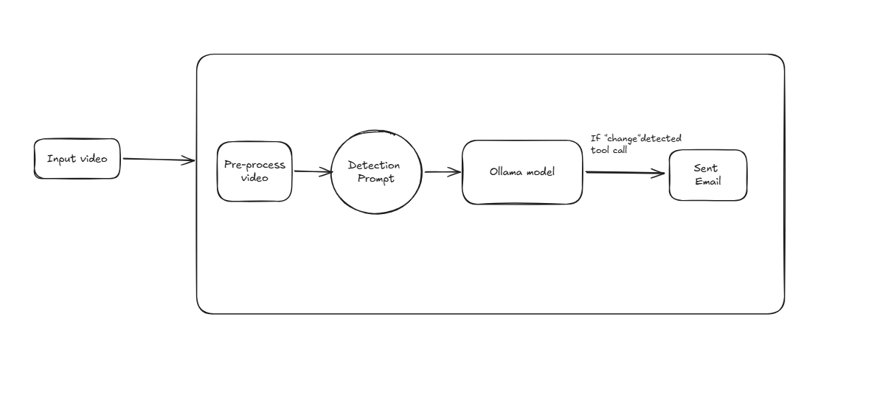
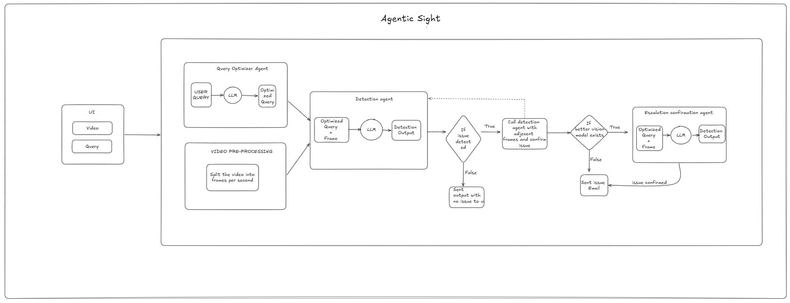

# Requirements & Architecture Evolution

*Proof of Concept — V1–V4*

## 1. Objective

Agentic Sight is a query-driven video intelligence system that analyzes a pre-recorded video against a natural-language detection request and identifies events, violations, or other conditions relevant to that request.

The system is designed as a proof of concept rather than a production surveillance platform. The initial focus is local inference, query-driven detection, evidence generation, configurable escalation, and event notification.

The architecture evolved through several iterations as implementation exposed practical constraints around model capabilities, video processing, inference cost, latency, and accuracy.

## 2. V1 — Single-Video Flag & Notify Pipeline

### Requirement

Build a system that can analyze a video and flag a responsible person when a specified event or change is detected. The initial POC uses pre-recorded video rather than a live stream.

For example, the system could detect when a person enters a restricted area. The exact definition of a "change" or "event" is constrained by what the available models can reliably detect.

### Functional Scope

- Accept a natural-language query describing what to detect and interpret the intent through an agent.
- Accept a video file as input and process it.
- Use a local, low-cost model to scan the video.
- If a potential match is detected, optionally escalate it to a stronger model, subject to model availability and cost.
- On a confirmed event, send an email to the responsible person.
- Log model activity for later analysis, including cost where available, latency, and escalation.

### Constrained By

- No live or streaming input — batch processing of a pre-recorded file only.
- Single detection type per run — a multi-node detection graph is deferred.
- No temporal or dwell tracking — a match on one analyzed frame can trigger an event.
- Local models only for the initial implementation using Ollama.
- The escalation tier is also local unless a cloud/stronger model is available and a budget is confirmed.
- Single recipient and single alert channel — email only, with no routing rules.



## 3. V2 — Frame-Based Video Analysis & Query Refinement

### Implementation Finding

Ollama does not provide a suitable direct video-processing model for the initial implementation. Because of the local-model and infrastructure constraints, the video is instead converted into individual frames and analyzed using a vision model.

### Design Change

The video is sampled into frames, for example one frame every 1–2 seconds, and the selected frames are processed individually using the Moondream model through Ollama.

This approach is less accurate than a model with stronger visual or video understanding, but it keeps the POC local and avoids introducing additional infrastructure or cloud cost.

### Query Refinement Agent

Before the query reaches the vision model, a separate agent refines the user's request into a clearer instruction describing what should be detected in the video.

```
User Query → Query Refinement Agent → Vision Model → Detection Result
```

For example, a broad request can be converted into a more specific visual detection instruction before it is sent to the vision model.

## 4. V3 — Intelligent Frame Sampling

### Problem

The frame-based approach can require a large number of model calls. For example, a 60-second video sampled every second requires approximately 60 frame-level analyses.

### Optimization

The system samples the video every 2 seconds for the initial scan. If a sampled frame indicates a potential violation, adjacent frames around that point are then analyzed.

```
Coarse Scan → Potential Detection → Adjacent-Frame Fine Scan
```

### Trade-off

This reduces the number of model calls and therefore improves processing time and local compute usage. However, an event that occurs entirely between sampled frames can be missed.

This approach is suitable for the current POC, where processing cost and local inference time are important constraints. The sampling interval can be adjusted later depending on the required detection sensitivity.

## 5. V4 — Configurable Escalation & Integrated UI

### Configurable Escalation

An escalation variable is introduced so that the system can optionally use a stronger model when the initial local model identifies a potential violation.

When escalation is enabled, the local model acts as the first screening layer. If it finds a potential violation, the relevant frame can be passed to a stronger model for additional analysis.

The stronger model is not currently available in the POC, but the escalation mechanism is kept configurable so that a stronger model can be integrated and evaluated later.

### Integrated UI

The backend pipeline works as an end-to-end system, so a simple UI is included in the same project to make the POC easier to test and demonstrate.

- Upload a video.
- Enter the detection query.
- Display the refined query produced by the first agent.
- Display the detection result and relevant evidence.
- Show a clear indication when model escalation occurs.
- Show the escalation result in the UI.
- Send the email notification while also showing the notification/escalation status in the UI.

### API

The backend is exposed using FastAPI so that the UI can communicate with the video-analysis pipeline.

The current API is intentionally synchronous: the request remains open until the video has been processed. This is acceptable for the POC and for videos ranging from seconds to low minutes. Background processing and polling can be introduced later if longer videos make synchronous requests impractical.

| Endpoint | Purpose | Description |
|---|---|---|
| `/health` | Health check | Returns the service status. |
| `/defaults` | Runtime configuration | Provides non-secret configuration used by the UI, including models, escalation state, sampling rate, and alert settings. |
| `/runs` | Run video analysis | Accepts the intent, recipient email, and video file and returns the pipeline result. |



The API also handles temporary storage of uploaded videos before they are passed to the pipeline, with the temporary file removed after processing.

## 6. Future Scope

- The current detection accuracy is limited by the model being used. Integrating a stronger model and testing the difference would be useful.
- If a person removes a helmet, wears it again, and removes it again, it is not yet defined whether the system should flag this as multiple events. Custom event and temporal logic would be needed for such cases.
- Evaluate how a dedicated video model performs compared with the current frame-based approach.
- Build a proper evaluation matrix across multiple models. Since the current models are relatively small, they work well only for certain cases; broader evaluation would help understand where each model performs well.
- Support notification channels beyond email, such as WhatsApp notifications or phone calls.
- Parallelize frame processing when inference is not constrained by running models locally through Ollama.

## 7. Conclusion

The Agentic Sight POC evolved from a simple video flag-and-notify pipeline into a query-driven, frame-based video analysis system with configurable sampling, optional model escalation, and an integrated UI. The current design keeps the implementation lightweight and local while leaving clear opportunities to improve accuracy, temporal reasoning, model selection, evaluation, and notification capabilities.

---

*See [`docs/RUNNING.md`](../RUNNING.md) for setup and run instructions.*
